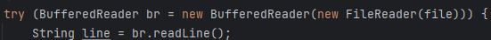
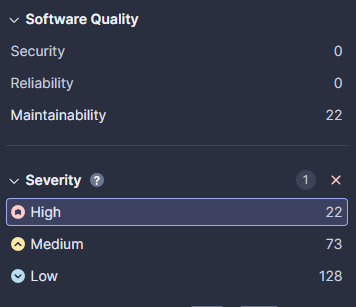
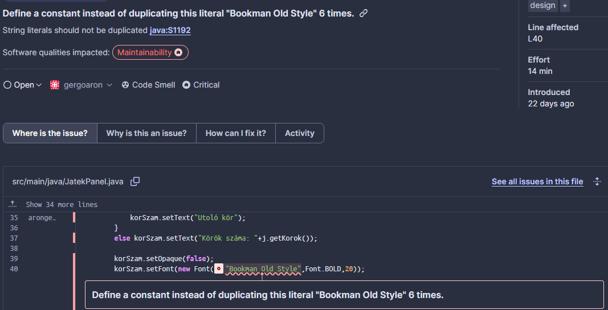
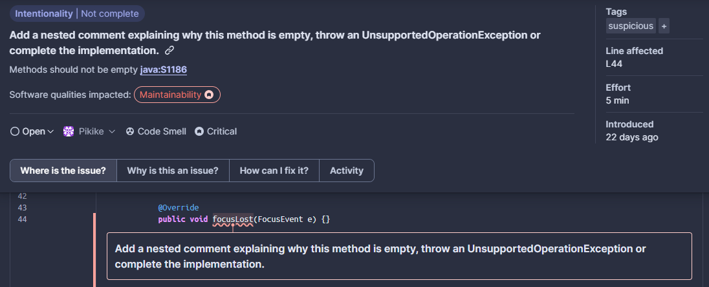
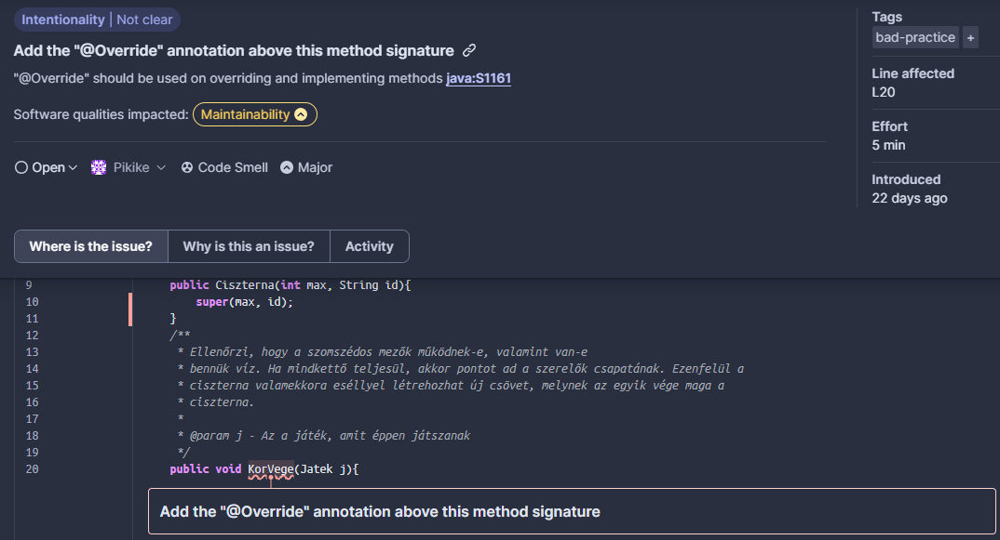

A SonarCloud kód analízisének eredménye:


Ez alapján feltételeztük, hogy a legfontosabbak, amelyeket mindenképp javítanunk kell:
- A ***Software Quality*** kategóriák közül a **Reliability** típusba esnek
- A ***Severity*** kategóriák közül a **High** típusba esnek

Kiválasztva a **__Reliability__** Issue-kat, kiderült, hogy mindkettő **High** **_Severity_**-vel rendelkezik

A két issue nagyban hasonlított egymásra:


Mindkettőt a try-with-resources funkcionalitással oldottuk meg. Ennek során egy try blokkbe tettük a Reader/Writer objektumok használatát az alábbi módon:



Ezután a két issue eltűnt a SonarCloud-ból.



## További Súlyos Issue-k:

### Konstans definiálása duplikáció helyett

3 darab hasonló hibajegy volt, amelyek a konstansok definiálásával voltak kapcsolatosak.



A megoldáshoz felvettük a szükséges konstansokat
```java
public static final String FONT_NAME = "Bookman Old Style";
public static final String CAN_STEP = " léphet";
public static final String STEPS_REMAIN = "Hátralevő lépések: ";
```
és ezeket használtuk a kódban.
```java
korSzam.setFont(new Font(FONT_NAME,Font.BOLD,20));
```

### Komment hozzáadása, hogy miért üres az adott metódus



Ez a hiba, ugyanebben a fájlban 3 másik helyen volt jelen.

A megoldáshoz az alábbi kommentet raktuk a metódusok törzsébe:
```java
 /**
  * projekt szempontjából ez a metódus nem szükséges, ezért nem lett implemetálva.
  *  /
```
Másik lehetőség volt egy kivátelt dobni:

```java
 throw new UnsupportedOperationException("projekt szempontjából ez a metódus nem szükséges, ezért nem lett implemetálva.");
           
```

### A metódusok ellátása @Override annotációval

Az adott hiba az adott fájlban 3 helyen is



Az alábbi kódrészlettel lett a probléma megoldva:

```java
@Override
    public void KorVege(Jatek j){...}

```
