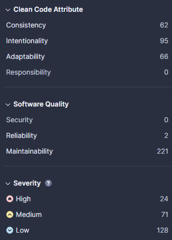
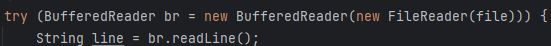

A SonarCloud kód analízisének eredménye:

Ez alapján feltételeztük, hogy a legfontosabbak, amelyeket mindenképp javítanunk kell:
- A ***Software Quality*** kategóriák közül a **Reliability** típusba esnek
- A ***Severity*** kategóriák közül a **High** típusba esnek

Kiválasztva a **__Reliability__** Issue-kat, kiderült, hogy mindkettő **High** **_Severity_**-vel rendelkezik

A két issue nagyban hasonlított egymásra:

Mindkettőt a try-with-resources funkcionalitással oldottuk meg. Ennek során egy try blokkbe tettük a Reader/Writer objektumok használatát az alábbi módon:

